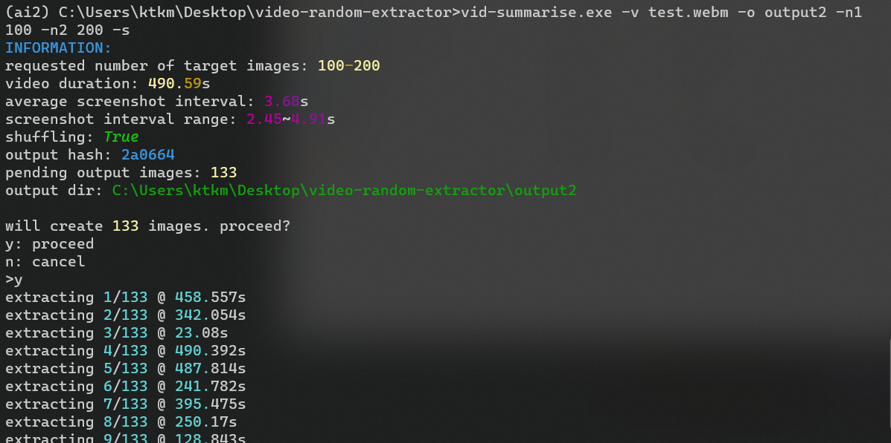
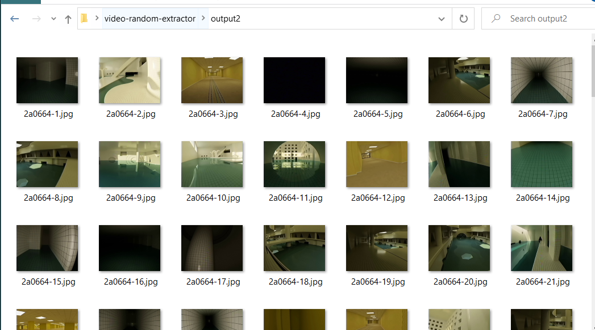

# video summariser
python program which takes a video file and extracts a number of screenshots at randomised intervals, producing a summary of a video in image form. randomisation gives a chance for frames between the regular interval to appear.

# requirements
python 3.10+

# setup
1. activate your python env
2. `pip install -e .` this repo
3. `vid-summarise` to use the program

# usage
`vid-summarise -h` for help

required arguments:

- `-v, --video`: select the video file
- `-o, --output`: select output folder. folder will be created if does not exist
- `-n1, --min`: select the minimum number of images you would like to create. due to randomisation, it will be above this value depending on your maximum chosen value
- `-n2, --max`: select maximum number of images you would like to create. due to the interval division algorithm, it is difficult to reach this max value, but it will increase the actual number of images generated. a larger range from your minimum value will increase randomness

the program will display the number of images that will actually be created and then ask for confirmation, so you can fine-tune your ranges in case it creates too much or too litle

